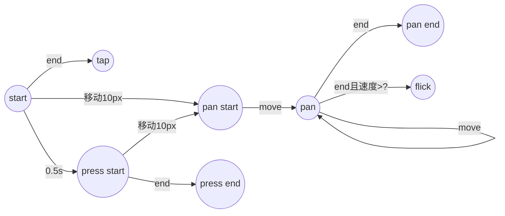

### 学习笔记


#### 手势状态转换图



#### 手势抽象

将逻辑抽取到一个统一的函数中，屏蔽桌面浏览器和触摸屏的差异。

```javascript

element.addEventListener("mousedown", event =>{
    start(event);
    //...
    //...
});

element.addEventListener("touchstart", event=>{
    for(let touch of event.changedTouches){
        start(touch);
    }
})

```
##### 为什么在触摸屏模式下还会触发 mousedown 事件呢？
看来触摸屏下面在tap 动作下会同时触发touchstart 和 mousedown 事件。


#### 避免多次 ClearTimeout
```javascript

    let handler = setTimeout(()=>{
        handler = null;
    }, 500);
```