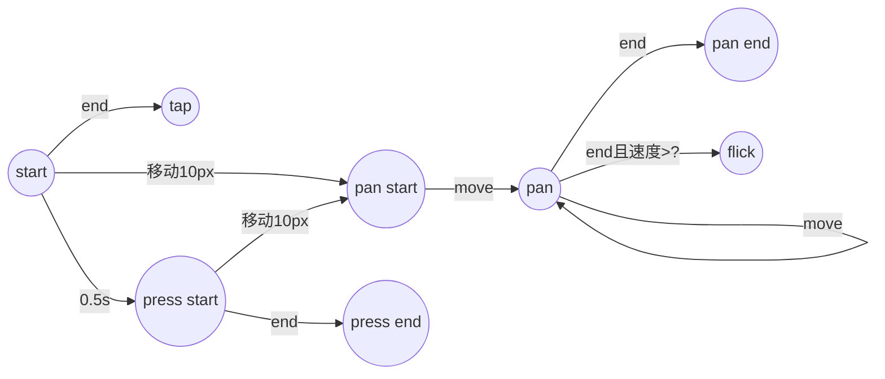

### 学习笔记

#### 手势状态转换图

```mermaid
graph LR;
    start((start))-->|end|tap((tap));
    start-->|移动10px|panstart((pan start));
    start-->|0.5s|pressstart((press start));
    pressstart-->|移动10px|panstart;
    pressstart-->|end|pressend((press end))
    panstart-->|move|pan((pan));
    pan-->|move|pan;
    pan-->|end|panend((pan end));
    pan-->|end且速度>?|flick((flick))

```

